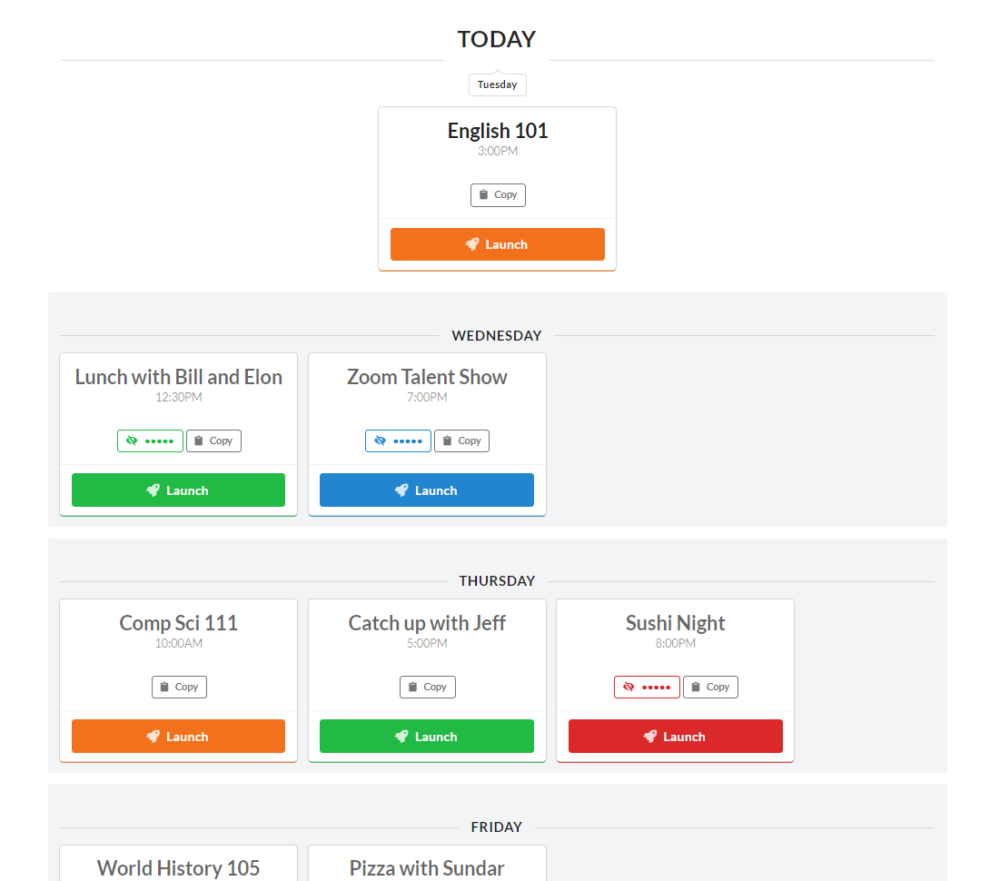

# Linki

[Try it out](https://linki.netlify.app)

A simple way to store and manage links for online video meetings.

-   Fully encrypted local data storage
-   Categorize meetings by day (Ex: Every Tuesday)
      - Results in automatic suggestions for meetings based on day and time. 
-   Unify links from different meeting software in one place

### Upcoming meetings are shown on top for easy access

